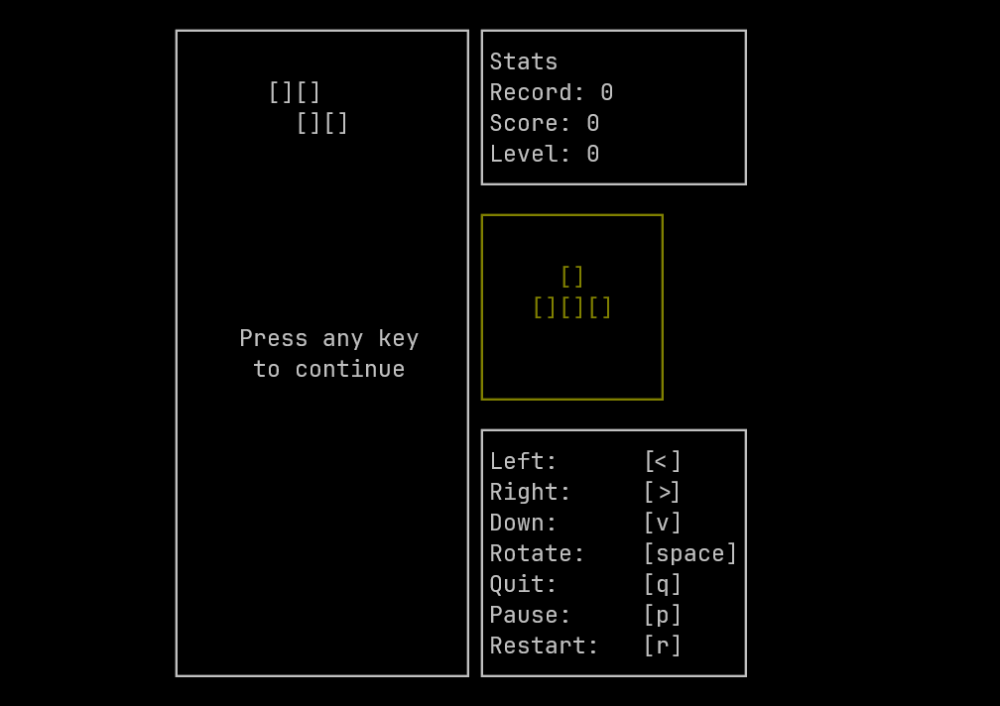

## Brick Game (Implementation on C)

**BrickGame** is a simple yet engaging implementation of a classic block-based game, written in C. This game offers a nostalgic experience similar to the traditional handheld brick games that many of us enjoyed during our childhood. It features smooth gameplay, basic graphics, and a challenge that increases as you progress.

## Features

- **Classic Gameplay**: Experience the traditional block-stacking gameplay with a modern touch.
- **High Score Tracking**: The game keeps track of your highest score, challenging you to beat your previous records.
- **Restart & Quit Options**: You can restart the game at any time or quit the game when you wish.
- **Simple Controls**: Easy-to-use controls that make the game accessible to players of all skill levels.

## Getting Started

### Prerequisites

To run this game, you will need:

- Compiler `gcc`.
- Lib`ncurses` for gui.

### Installation

1. **Clone the Repository**

   ```bash
   git clone https://github.com/Saracomethstein/BrickGame.git
   cd BrickGame
   ```

2. **Build and Run the Game**

   Use the provided `Makefile` to compile the game:

   ```bash
   make
   ```

### Controls

- **Arrow Keys**: Move the block left, right, or down.
- **Space**: Rotation block.
- **R**: Restart the game.
- **Q**: Quit the game.

## How to Play

The goal of the game is to arrange the falling blocks to form complete lines, which will then disappear, giving you points. The game speeds up as you progress, requiring quicker reactions and strategic placement of blocks. Your score is displayed during the game, and the highest score you achieve is saved and displayed.

## Code Structure

- `main.c`: The main logic of the game, including initialization, game loop, and handling user input.
- `brick_game/`: Contains the core game logic, including game state management and block movement.
- `gui/`: Handles the graphical interface using ncurses.
- `tests/`: Contains tests for different parts of the game.
- `record.txt`: Stores the highest score achieved.

## Contributing

Contributions are welcome! If you have any ideas or improvements, feel free to fork the repository and submit a pull request.

1. Fork the repository
2. Create a new branch (`git checkout -b feature-foo`)
3. Commit your changes (`git commit -am 'Add some foo'`)
4. Push to the branch (`git push origin feature-foo`)
5. Create a new Pull Request